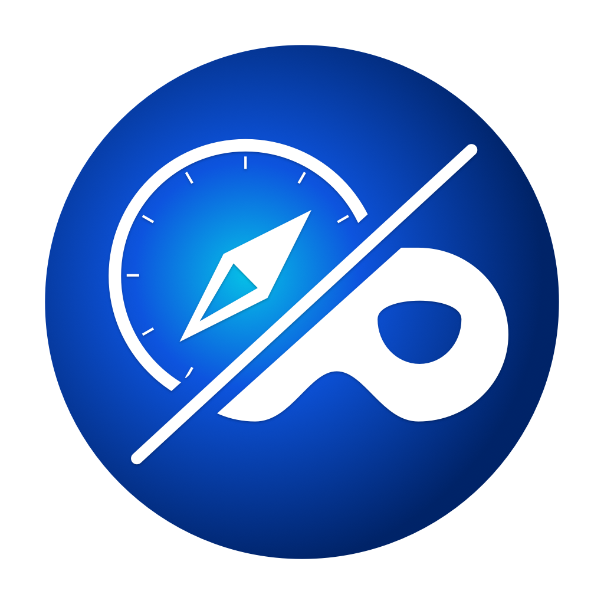

<a href="https://itunes.apple.com/de/app/is-it-private/id1440322906?l=en&mt=12">
 
</a>

# Is It Private?

_Is It Private_ is a Safari Extension providing a toolbar icon that changes its visual appearance if Private Browsing is enabled. This is especially helpful when the Dark appearance of macOS is activated.

## Installation

### App Store

_Is It Private_ is available on the [App Store](https://itunes.apple.com/de/app/is-it-private/id1440322906?l=en&mt=12) 🎉.

### GitHub Releases

1. Open the [releases](/releases) page and download the `IsItPrivate.app.zip` from the latest release.
1. Unzip the file and move `IsItPrivate.app` into your Applications folder.

### Build from Source

1. Clone this repository or download the source code of the [latest release](/releases/latest).
1. Open `IsItPrivate.xcodeproj` with Xcode and build the `IsItPrivate` scheme.

## Support

If you encounter any problems, feel free to [open an issue](/issues) or contact me [on Twitter](https://twitter.com/flofi).

## Privacy Policy

This privacy policy governs your use of the software application Is It Private ("Application"). The Application is a Safari App Extension providing a toolbar icon that changes its visual appearance if Private Browsing is enabled.

The Application does not store or transmit any personal details, nor does it include advertising, tracking software or analytics software that talks to third parties.

## Attributions

mask by b farias from the Noun Project -- [Link](https://thenounproject.com/browse/?i=795831)

Compass by Xinh Studio from the Noun Project -- [Link](https://thenounproject.com/browse/?i=51854)

## License

[MIT](LICENSE)
